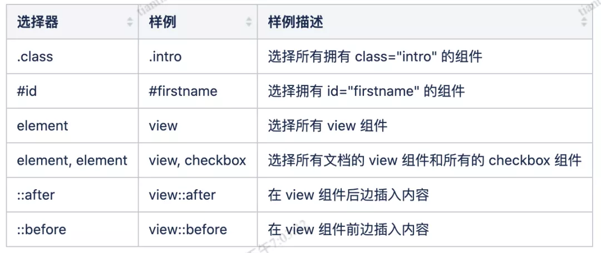

#minium使用说明
##安装
* 安装微信开发者工具

* 安装依赖minium

* 初始化项目
  
* 编写用例

* 执行用例

* 内置方法

* 元素定位

  参考例子：

假如要查找像上面这一个元素的话，他的选择器会像是下面这样：

tageName + #id + .className

view#main.page-section.page-section-gap
tagName ：类型选择器，标签名称，view、checkbox 等等，选择所有指定类型的最简单方式。
id：ID 选择器，自定义给元素的唯一 ID，使用时前面跟着 # 号，这是选择单个元素的最有效的方式。
className：类选择器，由一个点.以及类后面的类名组成，存在多个类的时候可以以点为间隔一直拼接下